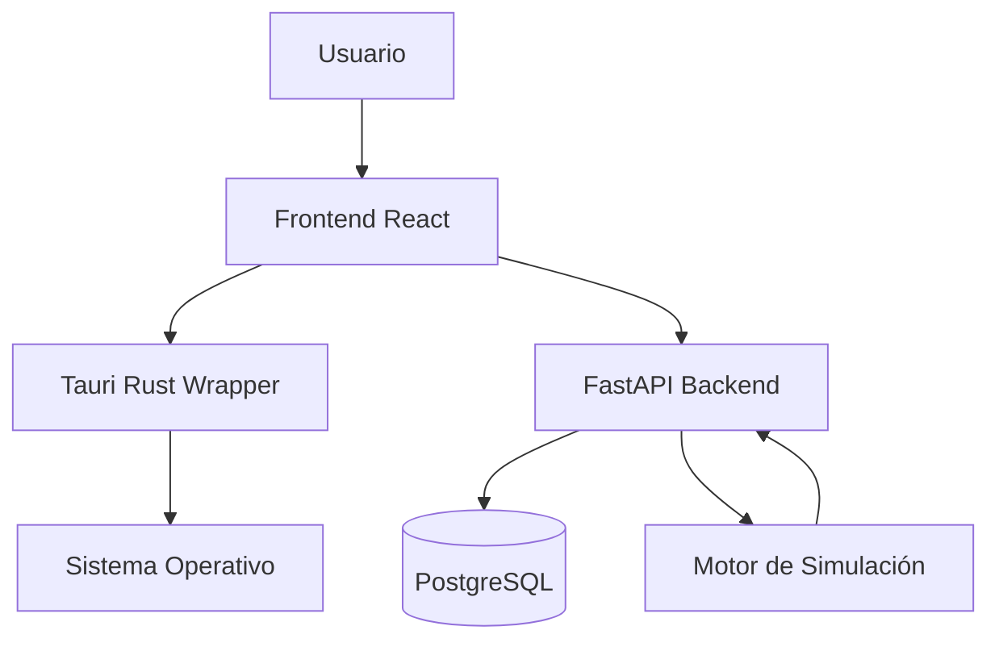

# Arquitectura del Sistema

## Descripción General
NetPro sigue una arquitectura de **cliente-servidor desacoplada**, donde el frontend actúa como una aplicación de una sola página (SPA) y el backend como una API RESTful. Para la distribución de escritorio, se utiliza **Tauri**, que permite envolver el frontend en una aplicación nativa optimizada utilizando Rust.

### Capas del Sistema:
1. **Capa de Presentación (Frontend):** Desarrollada en React. Se encarga de la visualización de la topología (usando React Flow), la gestión de estado local (Zustand) y la interacción con el usuario.
2. **Capa de Comunicación (Tauri/API):**
   - En modo web: Comunicación directa vía HTTP/JSON con el backend.
   - En modo escritorio: Tauri proporciona una capa de Rust que puede gestionar recursos nativos del sistema.
3. **Capa de Negocio (Backend):** Desarrollada en FastAPI. Gestiona la lógica de simulación, validación de usuarios, control de versiones y persistencia de datos.
4. **Capa de Datos (Base de Datos):** PostgreSQL, utilizada para almacenar usuarios, proyectos, versiones y logs de cambios.

## Diagrama de Flujo

## Descripción de Módulos

### Backend (Python/FastAPI)

#### `backend/app/main.py`
- **Propósito:** Punto de entrada de la aplicación. Configura el servidor FastAPI, los middlewares de CORS y el ciclo de vida (`lifespan`) para inicializar la base de datos.
- **Funciones principales:**
  - `lifespan()`: Maneja el inicio y cierre de la aplicación, incluyendo la espera de la DB y la carga de datos iniciales (seed).
  - `wait_for_db()`: Asegura que Postgres esté disponible antes de iniciar la API.
  - `seed_initial_data()`: Crea roles y usuarios predeterminados en el primer arranque.

#### `backend/app/models.py`
- **Propósito:** Definición de la estructura de datos de la base de datos utilizando SQLAlchemy ORM.
- **Clases principales:**
  - `Rol`: Define los niveles de acceso (Ingeniero, Supervisor, Superadmin).
  - `Usuario`: Almacena credenciales y vinculación con un rol.
  - `Proyecto`: Entidad principal que agrupa diversas versiones de una topología.
  - `Version`: Almacena el estado de la red en formato JSONB y el número de versión.
  - `Reporte`: Guarda los resultados de las simulaciones ejecutadas.
  - `Log`: Registro de cambios detallados asociados a cada versión.

#### `backend/app/database.py`
- **Propósito:** Gestión de la conexión asíncrona a PostgreSQL.
- **Componentes:**
  - `engine`: Motor de conexión SQLAlchemy.
  - `AsyncSessionLocal`: Fábrica de sesiones asíncronas para las consultas.
  - `Base`: Clase base declarativa para los modelos.

#### `backend/app/routers/`
- **Propósito:** Definición de los endpoints de la API organizados por dominio.
- **Módulos:**
  - `auth.py`: Gestión de tokens JWT y autenticación de usuarios.
  - `proyectos.py`: CRUD de proyectos de red.
  - `versiones.py`: Gestión de versiones y recuperación de estados JSON.
  - `usuarios.py`: Administración de cuentas y roles.
  - `actividades.py` / `logs.py`: Registro y consulta de historial de cambios.

### Frontend (React/TypeScript)

#### `frontend/src/App.jsx`
- **Propósito:** Enrutador principal de la aplicación basado en el estado global.
- **Lógica:** Utiliza un `switch` sobre la vista actual (`currentView`) para renderizar la página correspondiente (Login, Dashboard, Workspace, etc.).

#### `frontend/src/Monitor.jsx`
- **Propósito:** Panel de administración de usuarios.
- **Funcionalidades:** Búsqueda de usuarios, filtrado por rol, edición de roles y eliminación de cuentas.

#### `frontend/src/store/useNetProStore.js`
- **Propósito:** Gestión de estado global mediante Zustand.
- **Funcionalidades:** Control de la vista actual, almacenamiento de datos del usuario autenticado, manejo de errores y carga de datos desde la API.

#### `frontend/src/pages/`
- **Workspace:** Área de diseño donde se construye la topología.
- **Editor:** Interfaz para configurar los detalles de un nodo o enlace.
- **Simulation:** Vista de ejecución de simulaciones de red.
- **Report:** Visualización de métricas y resultados de simulación.

### Desktop Wrapper (Rust/Tauri)

#### `frontend/src-tauri/src/main.rs`
- **Propósito:** Punto de entrada de la aplicación de escritorio.
- **Lógica:** Configura el contexto de Tauri y define los comandos de Rust que pueden ser invocados desde el frontend.
